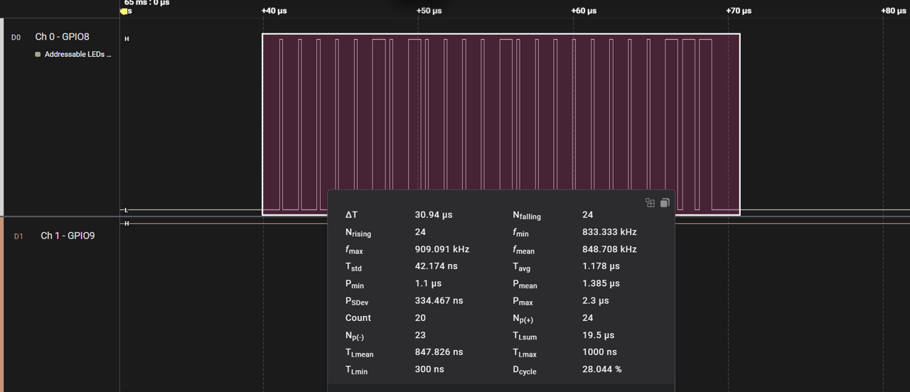
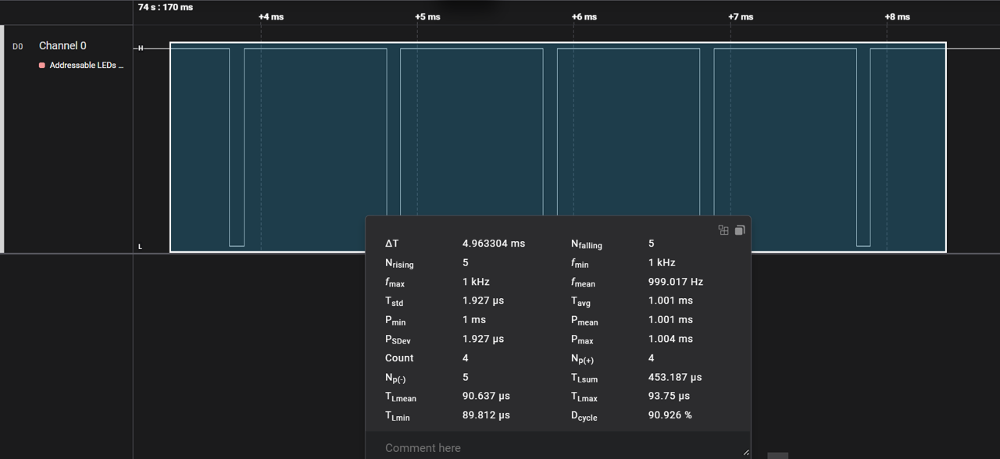
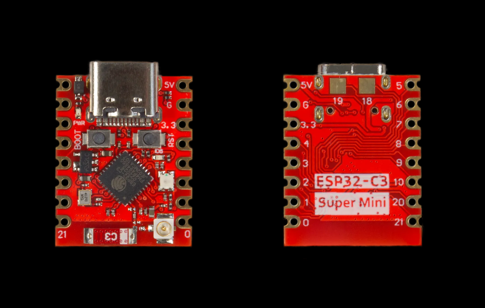
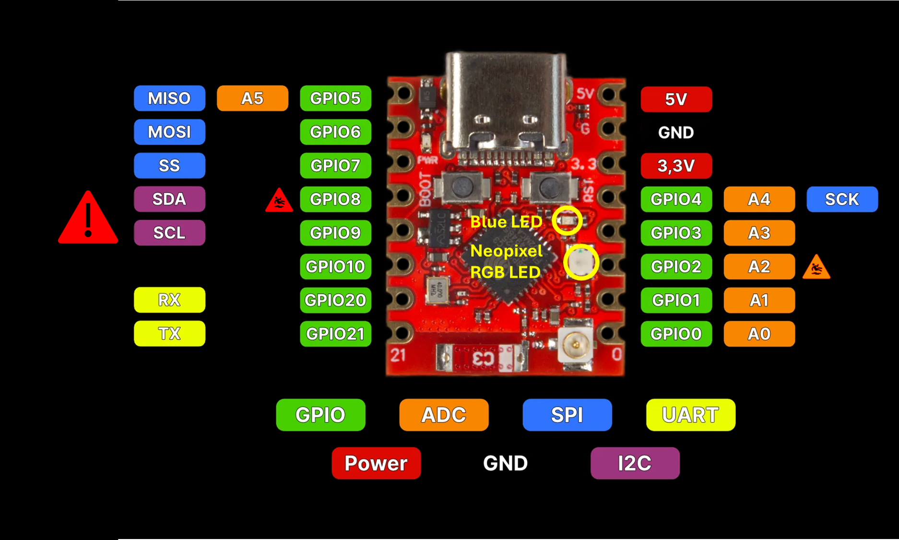

# ESP32C3 SuperMini Plus LED Manager 

[]()
[]()

This repository contains an Arduino library that simplifies control of the onboard `blue LED` and  `NeoPixel` RGB LED on the **ESP32-C3 SuperMini Plus** board.

## Overview
This library provides a convenient and robust way to control the onboard `blue LED` and the onboard `NeoPixel` (WS2812B RGB LED) on the **ESP32-C3 SuperMini Plus Development Board (V2.0 Red Board)**. It abstracts away the complexities arising from both LEDs sharing the same GPIO pin (GPIO8) and the specific timing conflicts that can occur.

## The Unique Challenge: Shared GPIO8 and Peripherie Conflicts
The **ESP32-C3 SuperMini Plus** board, while incredibly compact and versatile, presents a unique challenge for developers: both its onboard `blue LED` and its onboard `NeoPixel` (WS2812B RGB LED) are wired to the same GPIO pin: GPIO8.

### This shared pin creates a complex interaction because:
The `blue LED` is typically controlled using simple digital HIGH/LOW signals or Pulse Width Modulation (PWM) via the ESP32's `LEDC` peripheral. On this **ESP32-C3 SuperMini Plus Development Board (V2.0 Red Board)**, the `blue LED` is **NOT** inverted (LOW = OFF, HIGH = ON). This LED of the **"normal" ESP32C3 SuperMini Development Board** is inverted; it is sinked, not sourced (LOW = ON, HIGH = OFF).

The `NeoPixel` (WS2812B) requires a highly precise, time-sensitive serial data stream, which is generated by the ESP32's RMT (Remote Control Transceiver) peripheral.

### The Problem:

Since a `NeoPixel` (WS2812) uses a single data line – in our case GPIO8 – for the transmission of color information, switching directly between these two control methods on the same pin can lead to unexpected behavior. Our extensive testing has revealed a critical issue: When the `blue LED` is controlled with PWM at a very high duty cycle (e.g., values above 240 at 8-bit resolution), the `NeoPixel` may interpret this as a valid data signal and abruptly switch to full white brightness (RGB:255,255,255). This means that the correct timing of the data pulses is crucial for the correct operation of this `NeoPixel`, and this phenomenon is a direct consequence of an excessive duty cycle of the PWM signal for the `blue LED`, which triggers the `NeoPixel`.

### Motivation for this Library - A “Convenience Layer” for the ESP32-C3 SuperMini Plus:
Unlike many other ESP32-C3 boards or similar microcontrollers, this specific "SuperMini Plus" variant does not separate these LED controls onto different GPIOs, nor does it provide clear documentation on how to manage this shared resource. This library was developed through trial-and-error to provide a "convenience" layer that handles these intricate pin-state transitions and peripheral activations/deactivations automatically. It ensures that both LEDs can be controlled reliably and independently, preventing the unwanted NeoPixel "white flash" and other glitches by carefully managing the GPIO8 state and limiting the `blue LED's` PWM duty cycle to a safe value. 

Well, it's quite a lot of effort for such a “trivial” problem, but it took some time to verify the correct analysis and solution. I hope this solution is helpful to others.

### A brief explanation of why the implementation works reliably:

Both LEDs, as in our case, require two different protocols on one GPIO0 “bus” pin, which requires some explanation. The following illustration shows the timing of a single `Neopixel` RGB LED and clearly shows that the 24 bits are transmitted at 800 kHz in ~30 μs. The inertia of the human eye prevents us from noticing this “burst” in the `blue LED`.



The situation is different with the `blue LED`, as it is intended to display PWM-controlled brightness differences in addition to simple ON/OFF operation. This causes unexpected conflicts with the `Neopixel` LED at high `PWM` duty cycles, even at low frequencies of 1 kHz, which leads to a “misinterpretation” of the `Neopixel` LED of what is actually a high-frequency 24-bit protocol. Therefore, as shown in the following figure, the `PWM` duty cycle is kept below the threshold value of ~95% in this implementation to avoid triggering a HIGH bit in the `Neopixel `LED. 



It should also be mentioned that this library also implements the ON/OFF states using `PWM`.

---

## About the board

The **ESP32-C3 SuperMini Plus** is a highly integrated, ultra-compact development board based on the ESP32-C3 chip from Espressif Systems. It combines performance with minimal space requirements and was developed specifically for IoT applications with limited space. 

After a lengthy search, the following table was only found at one distributor, where the `RGB LED` (`Neopixel`) is only mentioned very briefly. Incidentally, this table does not indicate the correct number of exposed GPIOs; the correct number is 13.

| Parameter 			   | Specification |
| :------------------------------- | :------------ |
| Microcontroller                  | ESP32-C3 (RISC-V Single-Core, 160 MHz) |
| Chip model                       | ESP32C3FN4 |
| Wireless                         | 2.4 GHz, IEEE 802.11 b/g/n (Wi-Fi 4) |
| Bluetooth                        | 5.0 LE (Low Energy) |
| Memory                           | 400kb SRAM, 384kb ROM, 4MB Flash |
| USB                              | USB-C |
| GPIOs                            | 11 usable pins (PWM, 6x ADC, 2x UART, 1x SPI, 1x I2C) |
| Extremely low power consumption  | Deep sleep power consumption of approx. 43 µA |
| On-board LED                     | Blue light GPIO 8, **RGB LED** |
| Dimensions                       | 22.52 x 18 mm |
| Weight                           | 1.7 g |

An IPXE antenna can be connected.

### Picture of the circuit board:

Here you can see a front and rear view of this special **ESP32-C3 SuperMini Plus** board:



### Pinout of the Board:

Following extensive research, a valid pin assignment was finally identified for the 'special red circuit board'. This corresponds to the external pin assignment of the standard circuit board. However, the specific function of each pin is undocumented. Without a detailed understanding of the circuit, precise use cannot be guaranteed. In order to use the pin assignment correctly or deviate from it in a targeted manner, further knowledge of special features such as strapping and default I2C competitiveness with LEDs and BOOT buttons is required. However, we only address the corresponding GPIO8 differences between the ESP32C3 SuperMini Plus and the ESP32C3 SuperMini board here.



Unlike the standard board, the `blue LED` is not connected in reverse here. This alone would not be a problem, but the GPIO8 in question is also used as a “strapping pin” and is held at HIGH via a pull-up resistor to support the boot process correctly. This causes a small quiescent current to flow through the LED, which may start to glow slightly in reset mode or during flashing. On the standard board, GPIO8 is also held HIGH, but no significant current flows through the inverted LED because GPIO8 is configured as an input in these modes. I hope this insights are helpful to others.

### Important Note: GPIO8 and I2C (SDA)
While the ESP32-C3 features a flexible GPIO matrix that theoretically allows `I2C` (SDA/SCL) signals to be routed to almost any GPIO pin, using the default GPIO8 for `I2C SDA` on this specific board is strongly discouraged.

Given that GPIO8 is already shared by both the onboard `blue LED` and the onboard `NeoPixel`, attempting to use it simultaneously for `I2C` communication will inevitably lead to severe conflicts, unreliable operation, and unpredictable behavior for all connected components. The **RMT** peripheral (used by `NeoPixel)` and the **LEDC** peripheral (used by the `blue LED's` **PWM**) both demand precise control over GPIO8, making it unsuitable for a third, concurrent peripheral like `I2C`.

For `I2C` peripherals, please choose other available GPIO pins on the board. Default `I2C` pins for ESP32-C3 in Arduino IDE are  GPIO8 (SDA) and GPIO9 (SCL), but other pins like GPIO4 (SDA) and GPIO5 (SCL) are also common on ESP32-C3 boards. The ESP32's GPIO matrix allows you to define `I2C` pins in your code using Wire.begin(SDA_PIN, SCL_PIN);.   

Refer to the [ESP32-C3 Datasheet, Table 2-7: Peripheral Pin Assignment (page 23)](https://www.espressif.com/sites/default/files/documentation/esp32-c3_datasheet_en.pdf) for the official GPIO capabilities and default peripheral mappings.

### Criticism of the board design:
The extremely compact design is undoubtedly an attractive solution for many applications. However, there is no apparent reason why the two LEDs were placed on GPIOs that are also needed for other functions. Assigning them to unused (internal) GPIOs would have ruled out potential conflicts of use from the outset—other board designs show that this is possible.

---

## Installation
**Download:** Download this repository as a ZIP file.

**Arduino IDE:** In the Arduino IDE, go to Sketch > Include Library > Add.ZIP Library... and select the downloaded ZIP file.

**Dependencies:** This library depends on the Adafruit NeoPixel library. Install it via the Arduino Library Manager (Sketch > Include Library > Manage Libraries... and search for "Adafruit NeoPixel").

### Board Settings:

Select Tools > Board > ESP32 Arduino > ESP32C3 Dev Module.

Ensure Tools > USB CDC On Boot is set to Enabled for serial output.

## Usage
Include the library in your sketch:
```cpp
	#include "ESP32C3LEDManager.h"
```


Create an instance of the `ESP32C3LEDManager` class, specifying the shared GPIO pin (8) and the number of NeoPixels (1 for the onboard RGB LED):
```cpp
	ESP32C3LEDManager ledManager(8, 1);
```

You can then use the following methods to control the LEDs:

### Blue LED Control
```cpp
	ledManager.blueLEDOn();
	ledManager.blueLEDOff();
	ledManager.blueLEDToggle();
	ledManager.blueLEDFade(targetBrightness, durationMs); // targetBrightness 0-240, to avoid NeoPixel triggering
	ledManager.blueLEDSquareWave(frequencyHz, durationMs); 
```

### NeoPixel LED Control
```cpp
	ledManager.neoPixelSetColor(r, g, b);
	ledManager.neoPixelSetColorHSV(hue, sat, val);
	ledManager.neoPixelColorFade(durationMs); // 25% power
	ledManager.neoPixelOn(); // Sets to full white (100% power)
	ledManager.neoPixelOff();
```
## Example Sketches
This repository includes two example sketches:

	examples/BasicDemo/BasicDemo.ino: A simple demonstration of core functionalities.

	examples/FullDemo/FullDemo.ino: A comprehensive test that cycles through all available methods for both LEDs to demonstrate their independent operation despite sharing GPIO8.
 
